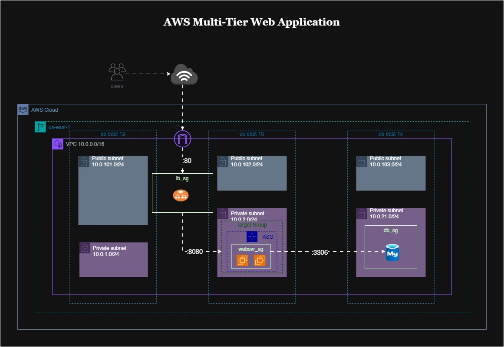

# Multi-Tiered Web Application in AWS

This repository provides a complete, production-ready example of deploying a multi-tiered web application on AWS using Terraform. The architecture leverages modular design principles, enabling you to provision and manage networking, autoscaling, and database resources independently or as a cohesive stack.

**Key Features:**

- Modular structure for networking, autoscaling, and database layers
- Uses AWS best practices for security, scalability, and high availability
- Easily customizable for different environments (dev, staging, prod)
- Example usage provided for quick integration

This project is ideal for DevOps engineers, cloud architects, and anyone looking to automate AWS infrastructure for scalable web applications.

---

## Architecture Diagram

The following diagram illustrates the high-level architecture of the deployed solution:



---

<!-- BEGIN_TF_DOCS -->

## Requirements

| Name      | Version |
| --------- | ------- |
| terraform | ~> 1.0  |
| aws       | 5.99.0  |
| cloudinit | ~> 2.1  |
| random    | 3.7.1   |

## Providers

No providers.

## Modules

| Name        | Source               | Version |
| ----------- | -------------------- | ------- |
| autoscaling | ./modules/ASG        | n/a     |
| database    | ./modules/database   | n/a     |
| networking  | ./modules/networking | n/a     |

## Resources

No resources.

## Inputs

| Name         | Description                         | Type     | Default | Required |
| ------------ | ----------------------------------- | -------- | ------- | :------: |
| env          | Name of the project environment     | `string` | "dev"   |    no    |
| project_name | Name of the project                 | `string` | n/a     |   yes    |
| region       | AWS region for resources            | `string` | n/a     |   yes    |
| ssh-keypair  | SSH keypair to use for EC2 instance | `string` | `null`  |    no    |

## Outputs

| Name        | Description                      |
| ----------- | -------------------------------- |
| db-password | Password for the database        |
| lb-dns-name | Domain name of the load balancer |

<!-- END_TF_DOCS -->

---

## Example Usage

Below is an example of how to use this project and its submodules in your own Terraform configuration:

```hcl
module "networking" {
  source         = "./modules/networking"
  vpc_cidr       = "<vpc-cidr-block>"                # e.g., "10.0.0.0/16"
  public_subnets = ["<public-subnet-1>", "<public-subnet-2>"]   # e.g., "10.0.1.0/24"
  private_subnets= ["<private-subnet-1>", "<private-subnet-2>"] # e.g., "10.0.3.0/24"
  region         = var.region
}

module "database" {
  source      = "./modules/database"
  db_name     = "<database-name>"         # e.g., "appdb"
  db_user     = "<database-username>"     # e.g., "admin"
  db_password = var.db_password           # Set this securely
  vpc_id      = module.networking.vpc_id
  subnet_ids  = module.networking.private_subnets
}

module "autoscaling" {
  source       = "./modules/autoscaling"
  env          = var.env
  project_name = var.project_name
  vpc = {
    vpc_id          = module.networking.vpc_id
    public_subnets  = module.networking.public_subnets
    private_subnets = module.networking.private_subnets
  }
  sg = {
    lb     = module.networking.lb_sg_id      # Load balancer security group ID
    websvr = module.networking.web_sg_id     # Web server security group ID
  }
  ssh_keypair = var.ssh_keypair              # Name of your AWS EC2 key pair
  db_config   = {
    db_host     = module.database.db_host
    db_user     = module.database.db_user
    db_password = module.database.db_password
  }
}
```

### Steps to Use

1. Clone this repository.
2. Configure your AWS credentials and set required variables (see `variables.tf`).
3. Run `terraform init` to initialize the modules.
4. Run `terraform apply` to provision the infrastructure.

---

## Footer

© 2025 Jonathan Atana. All rights reserved.
For questions or support, please open an issue or contact the maintainer.
